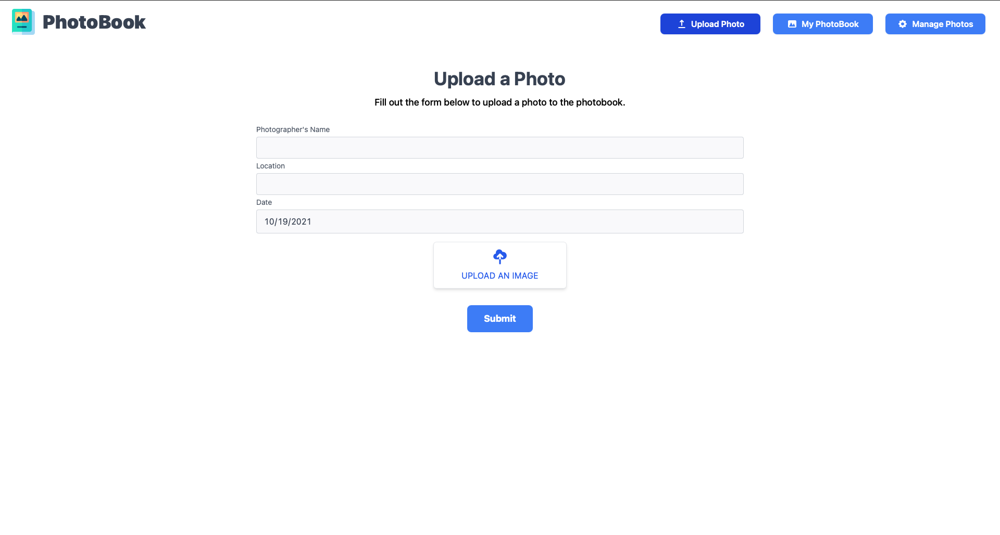
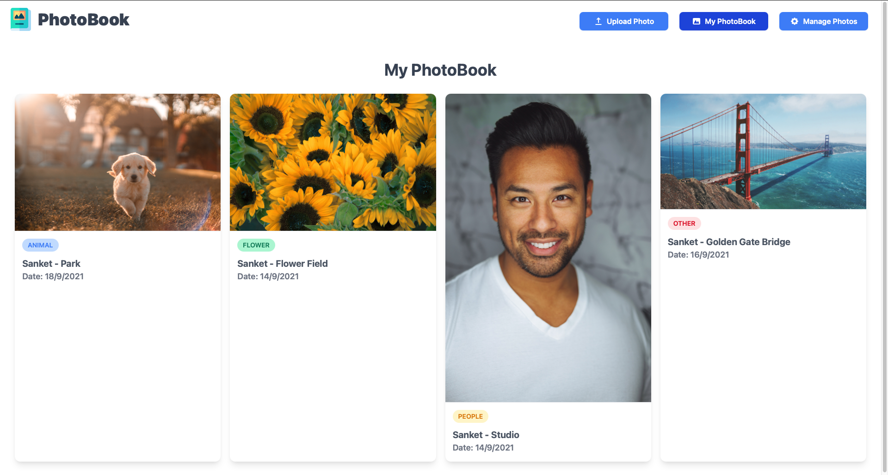
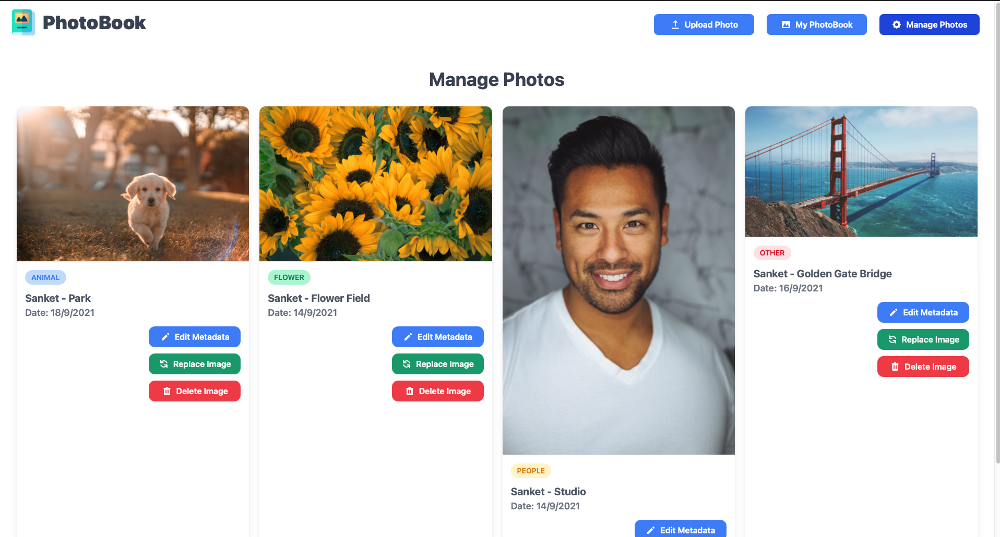
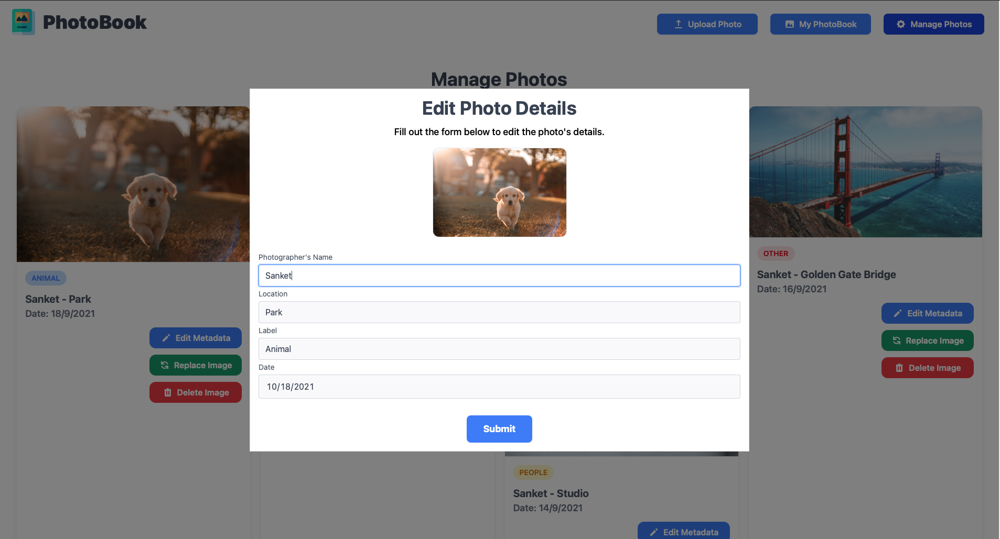
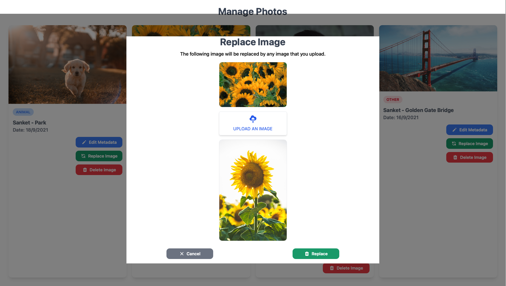

# CSC 847 - Project #2

## Project Introduction

This project has been developed using Next.js, Google Cloud Storage and Google Cloud Firestore. The project also has a Google Cloud Function which calls the Google Vision API in order to label any images that have been uploaded by the user. Finally, the project was deployed on Google's App Engine.

The app consists of 3 tabs which are as follows -

### Upload Photo

The user can use this tab to upload new photos to their PhotoBook. It has a form which consists of fields such as Photographer's Name, Location, Date and includes an upload button which is used to upload new photos to Google Cloud Storage.

### My PhotoBook

This tab displays all photos present in the user's PhotoBook. These photos have been labelled by the Cloud Vision API and have one of four labels - 'Animal', 'Flower', 'People' or 'Other'. If the user clicks on a photo, the photo is shown in a full screen modal.

### Manage Photos

This tab allows the user to manage their uploaded photos. It contains options such as Edit Metadata which allows the user to update a photo's details such as the Photographer's Name, Location, Label and Date. The manage tab also has options to Replace or Delete an image from the PhotoBook.

## Google's Billing Policy

The GCP components used in this project and their billing policies are as follows -

1. Google App Engine - This was used to deploy the Next.js web app. Google App Engine has a free tier which allows for 28 hours per day of "F" instances. This means that if the app has a relatively low load, it will remain free forever.
2. Cloud Functions - This was used to trigger the Cloud Vision API when a new image is uploaded to the Cloud Storage Bucket. Google Cloud Functions also have a generous free tier which means that no money was required to deploy and use the cloud function.
3. Cloud Storage - Google Cloud Storage also includes a free tier which allows for 5GB of space. Since the number of images uploaded to the Cloud Storage was relatively low, this limit wasn't reached and the service remained free.
4. Firestore - Firestore allows for 1GB storage and 50,000 reads and 20,000 writes per day. Since the web app's load was low, this limit was reached and the service remained free.
5. Cloud Vision API - The Cloud Vision API allows the first 1000 label detections per month for free. It then costs $1.50 per 1000 label detections. The total invocations remained well below 1000 and so this service was also free.

To conclude, all the services used in this project either had generous free tiers or were free forever and so the total cost of building and deploying this project was $0.00.

## Challenges faced while building this project

One of the main challenges I faced while building this project was the development of the labelling algorithm. The project description asked us to divide the images into one of four categories - Animals, People, Flowers and Other. However, the output of the Cloud Vision API did not involve these categories. For example, when an input image of a dog was provided, the Cloud Vision API returned labels such as Dog, Wood, Carnivore, Sunlight etc. This meant that the API was looking at the entire image and returning the labels of whatever it was able to find.
The resolve this issue, I was able to create different lists which corresponded to the 4 different labels and I was able to compare these lists to the labels of the Vision API to get the predicted category.

## Pros and Cons of Google App Engine

Pros of Google App Engine -

- Deploying the web app on GAE was simple and took less than 10 minutes.
- Google App Engine has a generous free tier which means that it can be used to host apps for free.

Cons of Google App Engine -

- Since Google App Engine is a fully managed service, a developer has very little control over it and can only make some changes by specifying them in the app.yaml file.

## Experience working with GAE as compared to GCE

My experience working with GAE was much better than my experience with GCE. This is because the deployment experience on GAE was much better and simpler than the experience on GCE. I believe one of the reasons for this was the stack that I am using and also the steep learning curve that comes with GCE.

## Additional Screenshots

